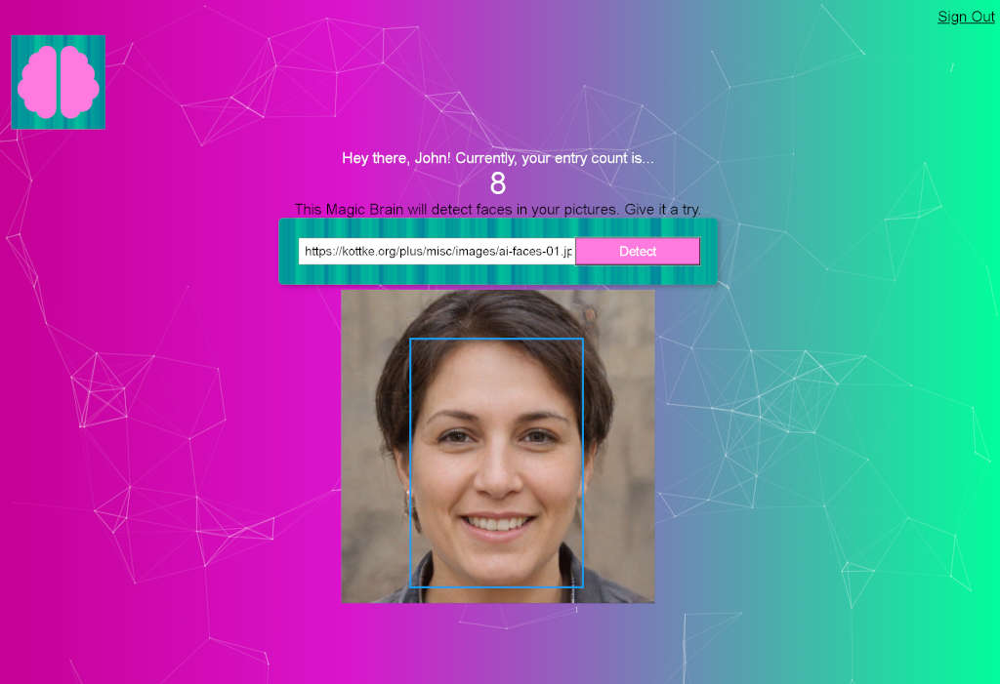

React app created to allow users to upload an image of a person and the AI will identify the face within the image./
Responsive functional-based Create-React-App that uses the Clarifai face-detection API./
A Node.js/Express.js server and PostgreSQL database allow users to sign-in and track submissions./
App created alongside Zero to Mastery Complete Web Developer course

Front End:
Create-React-App (HTML5, CSS3, JavaScript, JSX, Styled-Components)

Back End:
Node.js, Express.js, PostgreSQL

NPM Packages:
fontawesome
clarifai
react-particles-js
styled-components
tachyons